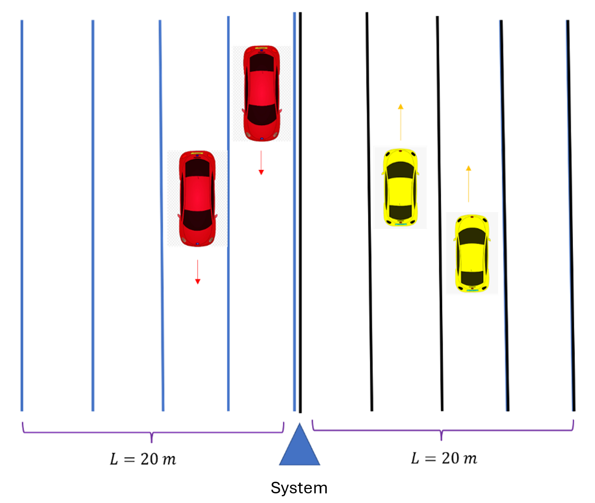
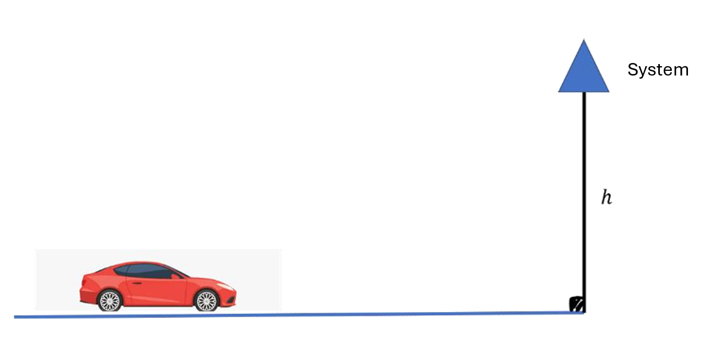
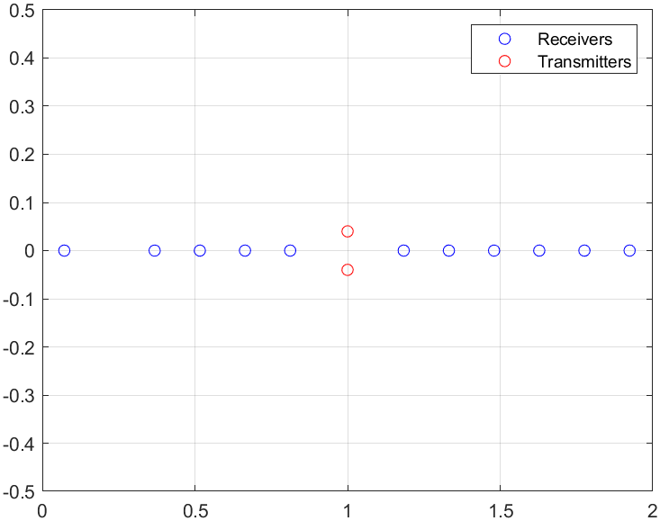
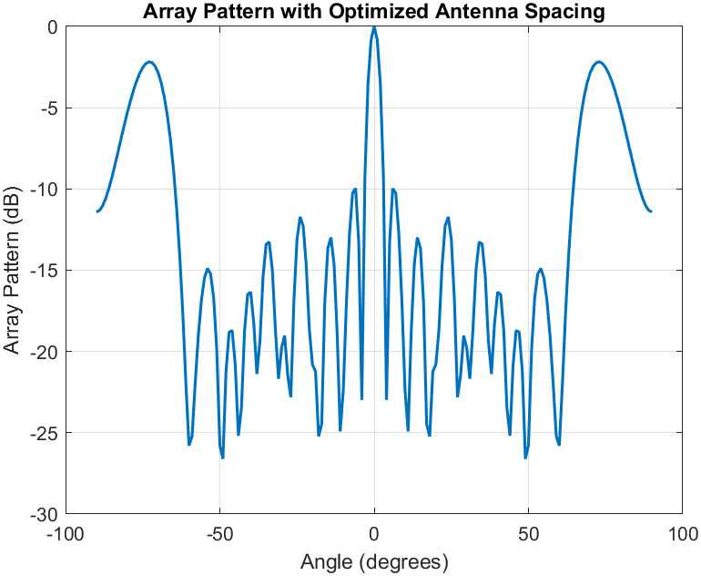
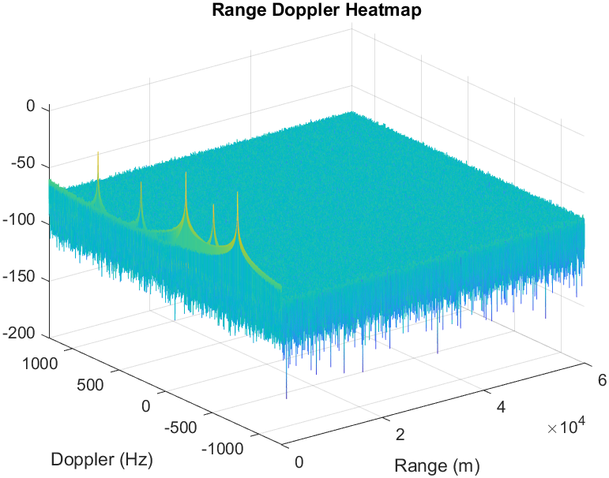
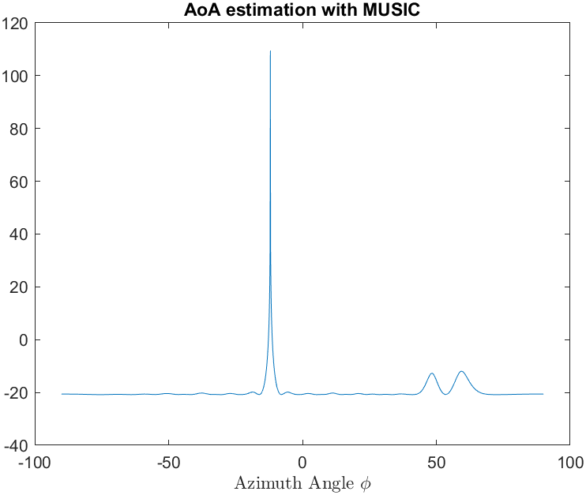
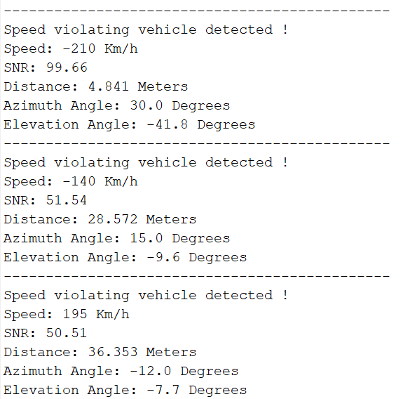

# Highway Radar Speed-Violation Detection (MATLAB)

Pulsed-radar simulation for **speed-violation detection** on a highway gantry/pole. The pipeline detects speeding vehicles and estimates **Doppler (speed)**, **AoA (azimuth via MUSIC)**, and **range (matched filter)** to support camera triggering.

**Course context:** Implemented as a course project for **Array Processing**, taught by **Dr. Saeed Akhavan**.

---

## Highlights
- Pulsed waveform (rectangular) with range + Doppler processing
- Speed-violator detection by Doppler-domain screening
- AoA estimation using **MUSIC**
- Range estimation via **matched filtering**
- Optional Rx placement optimization (CVX-based)

---

## Figures

### 1) System geometry (top/side view)

---

### 2) Array layout (Tx vertical, Rx horizontal)

---

### 3) Receiver Array pattern

---

### 3) Example Range–Doppler map (one scenario)

### 4) MUSIC spectrum (AoA estimation)

---

### 5) Detection output (console/table snapshot)

## System Overview

### Geometry
- Radar height: **h = 5 m**
- Targets: vehicles moving along the road with azimuth angle relative to boresight.
- Slant range is modeled as:
  $$
  R = \sqrt{h^2 + \left(\frac{d}{\cos(\phi)}\right)^2}
  $$
  where $ d $ is a ground-distance parameter used in simulation and $ \phi $ is azimuth.

### RF / Hardware Assumptions (as implemented)
- Carrier frequency: **fc = 2 GHz**
- Antenna gain (scalar): **G = 10**
- System loss factor: **System_Loss = 10**
- Noise figure: **NF = 5 dB**
- Detection threshold: **SNR_min = 30 dB** (simulation threshold)

### Waveform
- Rectangular pulsed waveform
- Pulse width: **τ = 50 ns** → bandwidth approximation **B = 1/τ = 20 MHz**
- PRI: **400 µs** → PRF = 2500 Hz
- Recording time: **T_recording = 0.4 s**
- Number of pulses: **N_pulses = 1000**
- Sampling rate: **fs = 40 MHz**

---

## Array Configuration

### Transmit (Tx)
- 2 elements, positions: `[-0.04, +0.04]` m (8 cm spacing)
- Additional per-element phase: `[0, 1.5]` rad

### Receive (Rx)
- 11 elements (positions defined in `main.m`)
- Effective horizontal aperture close to the 2 m constraint

### Antenna Pattern Model
A simplified separable approximation:
$$
G(\theta,\psi) \propto \cos(\theta)\cos(\psi)
$$

---

## Signal / Channel Model (Simulation)

### Doppler
$$
f_d = \frac{2v}{\lambda}
$$
Speed conversion is handled internally (km/h ↔ m/s). Estimation uses:
$$
v = \frac{f_d \lambda}{2}
$$

### Return Model (Simplified)
The received signal is synthesized by summing contributions of all Tx×Rx×target paths, including:
- Two-way propagation factors
- Constant RCS per target (default **RCS = 10 m²**)
- Array-dependent phase terms
- Two-way delay (implemented via `circshift`)
- Doppler modulation
- Additive thermal noise

---

## Processing Chain

Implemented in `processReceivedSignal.m`:

1) **Doppler screening for violators**
   - FFT-based filtering
   - Search only in speed-violating regions:
     - `speed_limit_km = 110`
     - `speed_max_km = 300`
     - `speed_sweep_step = 5`

2) **SNR thresholding**
   - Candidates below `SNR_min` are rejected.

3) **AoA estimation (MUSIC)**
   - Subspace method (SVD-based)
   - Scan: `Theta = -90:0.1:90` degrees

4) **Range estimation (matched filter)**
   - Beamform with the estimated steering vector
   - Frequency-domain matched filtering and peak-pick for range bin

Outputs per detected violator:
- Estimated speed
- Estimated SNR
- Estimated range + derived ground distance
- Estimated azimuth + derived elevation (from geometry)

---